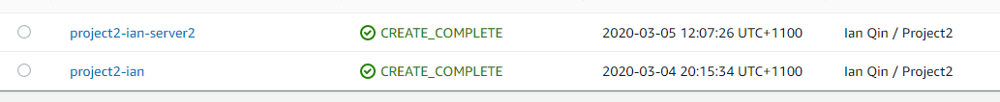

# Deploy a High-Availability Web App using CloudFormation

1.	CloudFormation output
 

 
http://proje-WebAp-1M0XMVB9NME3P-2135452274.us-west-2.elb.amazonaws.com
Having 502 bad gateway error but cannot see anything wrong with my configuration. 

2.	IAM role in place

3.	S3 bucket in place

 
4.	EC2 load balance and listener

 
 
